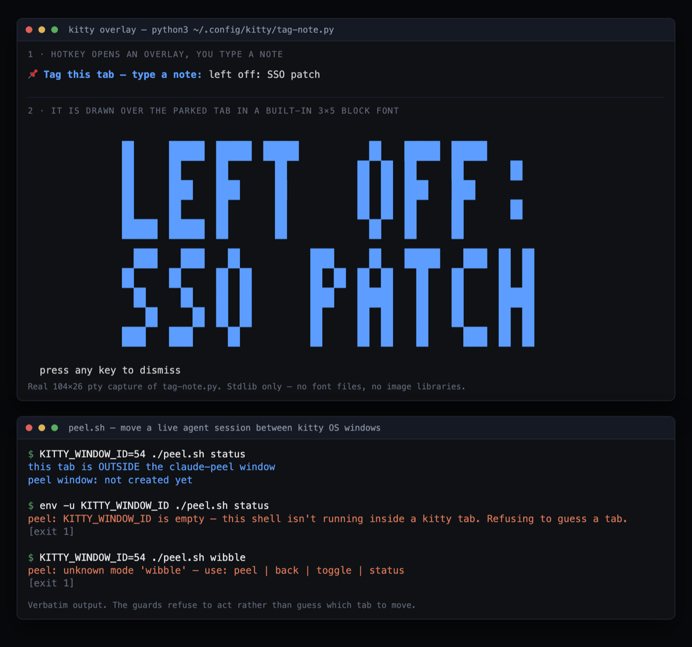

# claude-code-toolkit

Nine agent-invocable skills, two Claude Code slash commands, and 661 lines of Python and
bash that extend Claude Code, the OpenAI Codex CLI, and the kitty terminal. Every one of
them started as a failure that repeated: a deploy that reported success while serving a
cached page, an image backend that silently stretched any non-square request, a terminal
command that moved the wrong agent session.



## Run it

Two pieces run standalone, with no agent and no setup:

```bash
git clone https://github.com/joet203/claude-code-toolkit
cd claude-code-toolkit

python3 kitty/tag-note.py          # type a note, watch it drawn in block letters, press a key
bash kitty/peel-skill/peel.sh status
```

`tag-note.py` prompts, then paints your note across the lower half of the terminal in a
block font it carries itself. Outside kitty it pauses a few seconds first, looking for a
neighbouring session to dim behind the note, then draws anyway. `peel.sh status` prints which kitty window the current tab
is in; run outside kitty it exits 1 with `KITTY_WINDOW_ID is empty ... Refusing to guess
a tab`, which is the screenshot's second panel.

Installing a skill is a copy. They are discovered by their description, so nothing gets
registered and nothing gets restarted:

```bash
cp -R skills/claude/deploy   ~/.claude/skills/
cp -R kitty/peel-skill       ~/.claude/skills/peel
cp -R skills/codex/offbeat-joke ~/.codex/skills/
```

Optional environment: `COMFYUI_HOST` points `skills/claude/image-gen/comfy_gen.py` at a
non-default ComfyUI server (`http://127.0.0.1:8188` otherwise). The Vercel skills read the
token the `vercel` CLI already wrote to disk; no key is stored here. `plugins/codex` is a
packaged plugin (`.claude-plugin/plugin.json` plus its command); `plugins/vercel-deploy`
ships the command file only, so drop it straight into a commands directory.

## How it works

**A skill is a trigger plus a list of the ways this has gone wrong before.** The YAML
`description` is the entire dispatch mechanism, so it is written as the phrases a user
actually says, not a summary of the feature. Everything below it exists to stop the model
doing the obvious wrong thing. The deploy skill will not accept HTTP 200 as evidence: it
greps the live page for a string that was just added, because "Deployment succeeded"
survives a stale edge cache. The Codex plugin ships a table of five required flags with a
reason each, and the reason for `< /dev/null` is that stdin in an agent shell is an open
pipe that never sends EOF, so `codex exec` waits on it forever and looks like a hung
model. Factcheck lists the specific fabrications that got past earlier sessions. The
skills that get invoked correctly are the ones that name their failure modes.

**peel.sh is 108 lines of shell and most of it is choosing the right matcher.** It moves
a live agent session between kitty OS windows over the remote-control socket. Two details
carry the whole thing. kitty's `detach-tab` moves a tab into another window when given
`--target-tab` and into a brand new window when not, so peel and unpeel are one call with
one argument dropped. And the tab has to be matched with `window_id:$KITTY_WINDOW_ID`,
never `id:`, because `id:` resolves against tab ids first and the two id ranges overlap
once sessions have churned; that mismatch spent a debugging session being blamed on focus
and then on stale environment before the matcher turned out to be the cause. The script
refuses to act when it cannot identify its own tab rather than picking a plausible one,
and its error text names the fix, including the one case it cannot solve (a kitty started
from Spotlight is a different process and unreachable over the socket).

**The image and sprite scripts are mostly compensation for what the upstream models
actually do.** Pollinations serves Sana, which renders natively at 512 square: ask for 1600x640 and it
returns a stretched square, ask for a large square and it letterboxes with black bars.
`pollinations_gen.py` therefore renders a modest square regardless of what you asked for,
center-crops to your aspect ratio, and upscales with `sips`, so the caller just passes the
width and height it wants. `comfy_gen.py` builds the seven-node ComfyUI graph as literal
JSON, discovers the checkpoint name from `/object_info` instead of hardcoding it, and
exits 1 for an unreachable server versus 2 for a failed generation so a caller can retry
the right one. `process_sprite_sheet.py` treats generated sprite sheets as raw material:
it converts the fake checkerboard a model paints instead of transparency into real alpha,
finds each pose as a flood-filled connected component, then bottom-aligns every pose to a
single baseline in a fixed frame box and writes the pivot and frame counts to JSON, which
is the part that makes the frames usable in an engine.

## Limitations

- No tests and no CI. Nothing is packaged or versioned; installation is copying folders,
  and an update means copying them again.
- Parts are macOS-only. `pollinations_gen.py` shells out to `sips`, and the Vercel skills
  read the CLI token from `~/Library/Application Support/`.
- Several skills encode third-party CLI flags and API shapes as they were in mid-2026
  (Vercel's project API, Codex's sandbox flags, what Pollinations serves). When those
  change the skill is confidently wrong and nothing here detects it.
- `process_sprite_sheet.py` does its flood fill in pure Python with per-pixel `getpixel`.
  It is fine on one sheet of a few megapixels and slow on anything larger. It also needs
  Pillow, the only third-party dependency in the repo.
- Dispatch is by description, so overlapping descriptions compete. `skills/claude/deploy`
  and `skills/codex/vercel-deploy` already cover the same ground on two different CLIs.

## What's here

```
skills/claude/    deploy, factcheck, grill-me, image-gen, visualize
skills/codex/     vercel-deploy, game-sprite-pipeline, offbeat-joke
kitty/            tag-note.py, and peel-skill (a skill plus peel.sh)
plugins/          codex, vercel-deploy
```

Python 3 (standard library only, except Pillow in the sprite script), bash, kitty remote
control, Claude Code skills and plugins, Codex CLI skills.

## License

[MIT](LICENSE)
